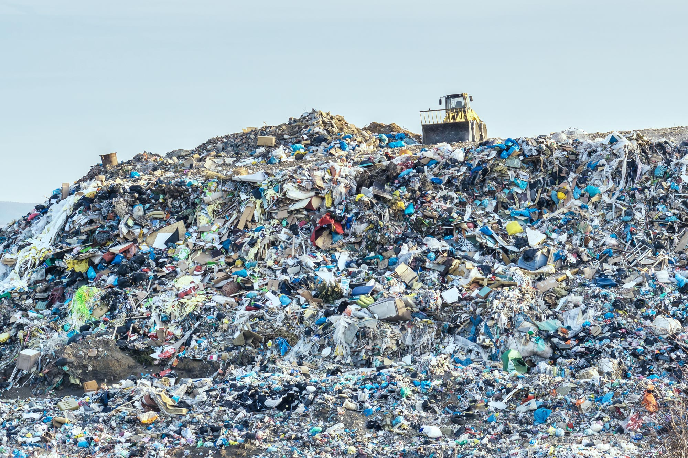

# Plastic Waste K-Means Clustering

Analyze and visualize global plastic waste patterns using K-Means clustering. This project clusters countries based on their mismanaged plastic waste data, revealing insights into global waste management trends and challenges.

## Project Overview

Plastic pollution is a critical environmental issue affecting ecosystems and human health worldwide. This project leverages K-Means clustering to group countries by their plastic waste characteristics, aiming to uncover patterns and inform better waste management strategies. The analysis focuses on mismanaged plastic waste per capita and total mismanaged waste, using data from 2010 and 2019.


## Data Description

**Source:**
- The dataset is sourced from Our World in Data.

**Variables:**
- Country: Name of the country
- Year: Year of observation (2010 or 2019)
- Mismanaged_Waste_per_Capita: Mismanaged plastic waste per capita (kg/day)
- Total_Mismanaged_Waste: Total mismanaged plastic waste (tonnes)
- Additional columns may include GDP per capita, population, etc.

**Format:**
- CSV file, located in the data/ directory.


---

## Installation & Setup

**Prerequisites:**  
- Python 3.7+  
- `pip` for package management

**Install dependencies:**

```bash
git clone https://github.com/yourusername/Exploratory-Data-Analysis-of-Plastic-Waste-Using-K-Means-Clustering.git
cd Exploratory-Data-Analysis-of-Plastic-Waste-Using-K-Means-Clustering
pip install -r requirements.txt
```
## Data:

Download the plastic waste dataset and place it in the data/ folder as plastic_waste.csv.

## Usage

Run the analysis in Jupyter Notebook:
```bash
jupyter notebook notebooks/project-presentation.ipynb
```
---
## Methodology

1. Data Preprocessing
- Load and clean the dataset, handling missing values and filtering for years of interest (2010, 2019).

2. Feature Selection & Scaling
- Select relevant features: mismanaged plastic waste per capita and total mismanaged plastic waste.
- Standardize features for clustering.

3. K-Means Clustering
- Apply K-Means clustering to group countries.
- Use the elbow method to determine the optimal number of clusters.

4. Visualization
- Visualize clusters using scatter plots and, optionally, world maps.

5. Results & Visualizations
- Countries are grouped into clusters based on their plastic waste profiles.
- Visualizations highlight geographic and economic patterns in plastic waste mismanagement.
- Key findings are discussed in the notebook and summary plots.

---
## License

This project is licensed under the MIT License. See the [LICENSE](LICENSE) file for details.

---

## Acknowledgments

- Data: [Our World in Data](https://ourworldindata.org/waste-management)
- Inspiration: Data science and machine learning open-source community
